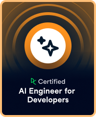
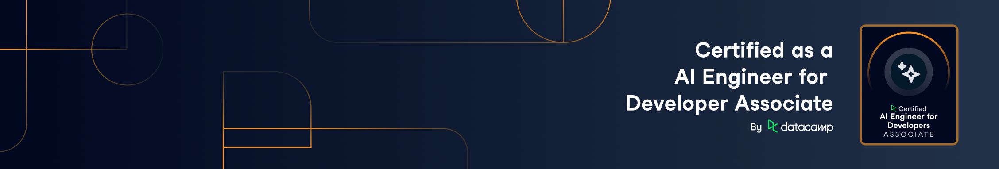

<h1 align="center">Hi 👋 I'm Abdullah Altunkaynak</h1>
<h3 align="center">Full Stack Developer | AI | Data Engineer Specialist</h3>

---

### 🚀 About Me

- 🌱 **AI Engineer Certified:** Proudly **AI Engineer for Developers Associate Certified by DataCamp** , specializing in core AI principles and efficient implementation.
<p align="center">
  
</p>

- 🔭 **Specialized AI Solutions:** Focused on integrating intelligent agents and predictive models into enterprise backend systems.
- 🏆 **Featured Project:** Check out my **AI Agent Marketplace & Arena:** [AgentArena.me](https://agentarena.me/) 
- 🔭 Actively developing **enterprise-level backend systems, cross-platform mobile applications, and AI-driven automation tools**.
- 🌱 Improving myself in **Clean Architecture, Microservices, Advanced SQL & Deep Learning for Computer Vision and NLP**.
- 👯 Open to **collaboration on open-source projects involving AI integration, Microservices, or Scalable Architectures**.
- 🤔 Looking for **code reviews and feedback to grow further**
- 💬 Ask me about **C#, ASP.NET Core, OpenAI API, Prompt Engineering, Flutter, SQL, PL/SQL**
- ⚡ Fun fact: I love transforming data into intelligent, actionable insights through clean software solutions.

---

### 🧠 Tech Stack (Enhanced with AI)

#### 🤖 AI & Machine Learning


#### 💻 Backend


#### 📱 Mobile


#### 🛠 Tools & IDEs


#### 🗄 Databases


---

### 🔥 What I'm Currently Working On
- 🏗 Architecting an **ASP.NET Core Backend with Integrated AI agents for automation**.
- 📱 Developing intelligent, context-aware **Flutter Mobile Applications**.
- ⚙ Optimizing complex **PL/SQL systems for predictive analytics**.
- 🧠 Designing and deploying **Microservices for scalable AI inferencing**.

---

### 🌍 Connect With Me

<p align="center">
  <a href="https://agentarena.me/">
    
  </a>
  <a href="https://github.com/abdullah-altunkaynak">
    
  </a>
  <a href="https://www.linkedin.com/in/abdullah-altunkaynak-51104730b/">
    
  </a>
  <a href="https://medium.com/@altunkaynakabdullah99">
    
  </a>
</p>

<p align="center">
  <!--START_SECTION:waka-->

```txt
From: 27 March 2026 - To: 21 April 2026

Total Time: 78 hrs 39 mins

Dart                       35 hrs 51 mins        ███████████▒░░░░░░░░░░░░░   45.58 %
Other                      10 hrs 43 mins        ███▒░░░░░░░░░░░░░░░░░░░░░   13.63 %
JavaScript                 10 hrs 19 mins        ███▒░░░░░░░░░░░░░░░░░░░░░   13.12 %
C#                         6 hrs 48 mins         ██░░░░░░░░░░░░░░░░░░░░░░░   08.65 %
Markdown                   4 hrs 58 mins         █▓░░░░░░░░░░░░░░░░░░░░░░░   06.31 %
Python                     3 hrs 8 mins          █░░░░░░░░░░░░░░░░░░░░░░░░   03.99 %
Binary                     2 hrs 9 mins          ▓░░░░░░░░░░░░░░░░░░░░░░░░   02.74 %
YAML                       58 mins               ▒░░░░░░░░░░░░░░░░░░░░░░░░   01.24 %
Kotlin                     46 mins               ▒░░░░░░░░░░░░░░░░░░░░░░░░   00.99 %
Bash                       43 mins               ▒░░░░░░░░░░░░░░░░░░░░░░░░   00.91 %
```

<!--END_SECTION:waka-->
  
  
</p>


### 📊 GitHub Stats

<p align="center">
  
  
</p>

---

<p align="center">🔥 Clean Code • Scalable AI Architecture • Intelligent Insights 🔥</p>
